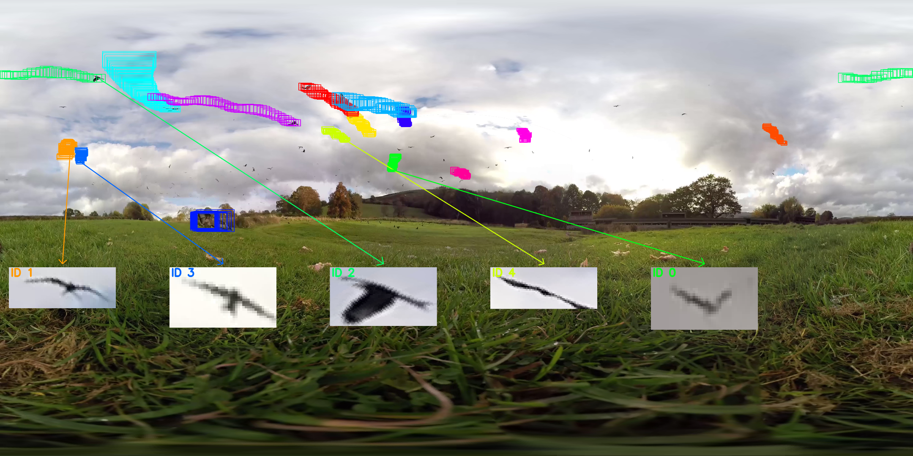
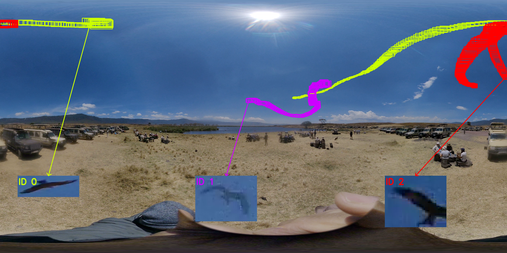
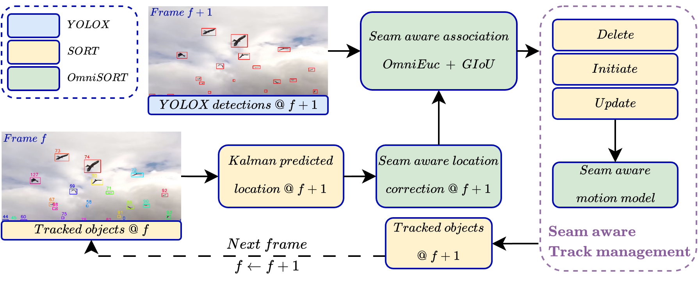
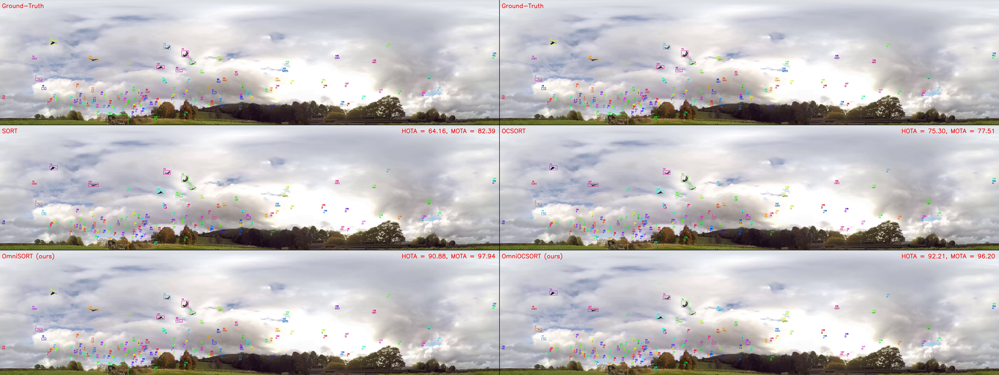

# OmniSORT

**Re-Engineering Sort-Based Algorithms for Low Cost Small Object Tracking from Omnidirectional Footage**

---

## Overview

Most multi-object trackers are designed for standard cameras and often rely on heavy appearance models. These assumptions do not work well for low-cost omnidirectional footage, where seam discontinuities and tiny fast-moving targets make tracking difficult.

This repository presents two modifications of SORT-based trackers (SORT and OCSORT) to adapt multi small objects tracking from omnidirectional footages.

## Contributions

- A **seam-aware Kalman filter** that preserves spherical continuity across projection borders;
- **OmniEuc + GIoU** ($E_{fuse}$) for more robust object association in omnidirectional tracking;
- **OmniSmall**, a benchmark for small-object tracking in omnidirectional footage, with real-world trajectories, strong distortion, and frequent seam crossings.
---
## Dataset Snapshot
<p align="center">
  
  
</p>
<p align="center">
  
  
</p>
Representative frames from four omnidirectional sequences illustrating object trajectories. Coloured bounding boxes accumulated over time visualise the per-object tracks in the equirectangular projection. The upper-right frame shows honey bees around a flower bed (after a 90&deg vertical rotation of projection), while the remaining frames show avian species. Insets show zoomed-in crops of several tracked identities, highlighting strong appearance ambiguity.<br /><br />

**Links to dataset:**<br />
OmniSmall:
```bash
https://huggingface.co/datasets/xinsxins/OmniSmall
```
JRDB:
```bash
https://jrdb.erc.monash.edu/dataset/panotrack
```

## Method
<p align="center">
  
</p>

Our approach revisits SORT-style tracking for omnidirectional small-object scenarios and introduces modifications designed for limit compute resource, weak-appearance, motion-dominated tracking.

### 1. $Kalman\ Speed\ Update$: Seam-Aware Motion Model

Standard motion updates can break near the association at borders of an equirectangular frame, where an object may appear to jump across the seam. Our seam-aware Kalman speed update accounts for this wrap-around behaviour, giving more stable motion prediction in omnidirectional footage.
### 2. $OmniEuc$: Seam-Aware Euclidean Distance

Standard Euclidean distance does not reflect true proximity when objects are close across the image seam. OmniEuc fixes this by measuring distance in a seam-aware way, making object association more reliable in omnidirectional views.
### 3. $E_{fuse}$: Composite Association Metrics

$E_{fuse}$ combines **OmniEuc** with **GIoU** to build a stronger association cost. This helps the tracker use both seam-aware position cues and box-overlap cues when matching detections across frames.

---
## Results

Demonstration video of tracking performance. <br />
**Footage**: BBC Earth. <br />
**Top row**: Ground Truth label. <br />
**Middle row**: predicted label by 2 baselines (SORT and OCSORT). <br />
**Bottom row**: predicted label by OmniSORT and OmniOCSORT. <br />
*Note: in case the video cannot rander, the source file locates at <ins> assets/video/demo_bbc_earth.mp4</ins>*

[](https://github.com/user-attachments/assets/39593f4a-2d6e-4132-9428-f2031833091a)
<!-- 
<video
  src="https://github.com/user-attachments/assets/39593f4a-2d6e-4132-9428-f2031833091a"
  poster="./assets/image/thumbnail_bbc_earth.png"
  controls
  height="800">
</video> -->
### Main results (JRDB + OmniSmall)

Best value in each column is **bold**. `λ` is the per-setting fusion weight in $E_{fuse}$, chosen by grid search (see paper Table II/III).

#### Ground-truth detections

| Method | λ | JRDB HOTA↑ | JRDB MOTA↑ | JRDB IDF1↑ | JRDB IDSw↓ | JRDB FPS↑ | λ | Omni HOTA↑ | Omni MOTA↑ | Omni IDF1↑ | Omni IDSw↓ | Omni FPS↑ |
|---|---:|---:|---:|---:|---:|---:|---:|---:|---:|---:|---:|---:|
| SORT | – | 62.43 | 95.80 | 55.22 | 13819 | 446 | – | 66.98 | 86.02 | 80.31 | 559 | 836 |
| ByteTrack | – | 65.34 | 96.07 | **60.49** | 12856 | **575** | – | 71.84 | 90.88 | 90.12 | 94 | **1459** |
| OCSORT | – | 66.24 | 96.14 | 56.20 | 13470 | 380 | – | 85.61 | 89.75 | 83.99 | 382 | 670 |
| HybridSORT | – | 66.80 | 96.00 | 56.86 | 11345 | 205 | – | 64.98 | 74.97 | 60.61 | 1247 | 273 |
| **OmniSORT + $E_{fuse}$ (ours)** | 0.3 | **67.69** | 95.82 | 58.44 | **8968** | 402 | 0.7 | 94.10 | **99.24** | 94.00 | **42** | 1032 |
| **OmniOCSORT + $E_{fuse}$ (ours)** | 0.2 | 67.01 | **96.22** | 57.84 | 9415 | 311 | 0.7 | **94.12** | 99.16 | **94.16** | 62 | 716 |

#### YOLOX detections

| Method | λ | JRDB HOTA↑ | JRDB MOTA↑ | JRDB IDF1↑ | JRDB IDSw↓ | JRDB FPS↑ | λ | Omni HOTA↑ | Omni MOTA↑ | Omni IDF1↑ | Omni IDSw↓ | Omni FPS↑ |
|---|---:|---:|---:|---:|---:|---:|---:|---:|---:|---:|---:|---:|
| SORT | – | 26.45 | 27.94 | 25.94 | 22563 | 332 | – | 39.04 | 20.31 | 45.88 | 117 | 1152 |
| ByteTrack | – | **31.92** | **46.02** | **35.45** | **8965** | **719** | – | 30.29 | 17.11 | 32.59 | **29** | **3175** |
| OCSORT | – | 26.45 | 27.42 | 25.85 | 22966 | 252 | – | 39.81 | 22.14 | 46.76 | 127 | 863 |
| HybridSORT | – | 29.53 | 35.83 | 30.16 | 16663 | 174 | – | 37.75 | 22.45 | 44.19 | 152 | 518 |
| OmniSORT + $E_{fuse}$ (ours) | 0.2 | 25.35 | 27.94 | 24.35 | 22594 | 320 | 0.7 | 41.11 | 25.42 | 49.33 | 137 | 1122 |
| **OmniOCSORT + $E_{fuse}$ (ours)** | 0.2 | 27.70 | 35.20 | 27.58 | 18209 | 260 | 0.7 | **41.76** | **26.97** | **50.72** | 108 | 862 |

**Takeaway.** With ground-truth detections, the seam-aware modifications give large, consistent gains on OmniSmall (the target regime: small, fast, seam-crossing targets) and stay competitive on JRDB despite not winning every column there. With a real (YOLOX) detector, the picture is more honest: gains persist on OmniSmall, but on JRDB the score-aware two-stage trackers (ByteTrack, HybridSORT) win — our single-stage seam-aware association isn't a substitute for detection-confidence handling on dense, pedestrian-scale, noisy detections. Neither tracker is the fastest in raw FPS (that's SORT/ByteTrack), but both stay well within CPU-only, real-time throughput.

---

### Ablation Study

Conducted on **OmniSmall with ground-truth detections**, isolating each component's contribution. For **OmniSORT**, the baseline is **SORT**; for **OmniOCSORT**, the baseline is **OCSORT**. `p̄` is the average p-value (paired per-sequence exact sign-flip test) across HOTA, MOTA, and IDF1 against that baseline; best configuration per tracker in **bold**.

| Tracker | Configuration | HOTA | MOTA | IDF1 | p̄↓ |
|---|---|---:|---:|---:|---:|
| SORT | baseline (IoU) | 66.98 | 86.02 | 80.31 | — |
| | + SAMM | 20.05 | 18.29 | 14.20 | 0.0052 |
| | + GIoU (λ=0.0) | 60.53 | 69.20 | 56.14 | 0.0938 |
| | + OmniEuc (λ=1.0) | 73.75 | 92.65 | 68.73 | 0.0260 |
| OmniSORT + $E_{fuse}$ | λ=0.1 | 69.86 | 78.58 | 66.04 | 0.2526 |
| | λ=0.3 | 85.33 | 90.52 | 83.68 | 0.0221 |
| | λ=0.5 | 91.07 | 94.83 | 90.67 | 0.0039 |
| | **λ=0.7** | **94.10** | **99.24** | **94.00** | 0.0039 |
| | λ=0.9 | 92.67 | 98.92 | 92.48 | 0.0039 |
| OCSORT | baseline (IoU) | 85.61 | 89.75 | 83.99 | — |
| | + SAMM | 23.67 | 24.82 | 18.16 | 0.0052 |
| | + GIoU (λ=0.0) | 65.71 | 76.17 | 60.67 | 0.0104 |
| | + OmniEuc (λ=1.0) | 52.23 | 71.03 | 36.29 | 0.1888 |
| OmniOCSORT + $E_{fuse}$ | λ=0.1 | 73.45 | 82.27 | 69.29 | 0.0078 |
| | λ=0.3 | 87.25 | 91.88 | 86.01 | 0.0078 |
| | λ=0.5 | 90.96 | 94.82 | 90.73 | 0.0039 |
| | **λ=0.7** | **94.12** | **99.16** | **94.16** | 0.0039 |
| | λ=0.9 | 66.78 | 84.96 | 56.02 | 0.0846 |

**Takeaway.** SAMM alone (a seam-aware velocity model with no compatible non-overlap association cost) collapses tracking — the corrected velocity state has nothing but IoU to pair it with, and IoU-based matching still needs box overlap that a corrected-but-still-small, fast target rarely has. The two single-term endpoints (GIoU-only, OmniEuc-only) each partially recover performance but both remain below the fused peak. $E_{fuse}$ combines the two into a cost that consistently beats both endpoints and the unmodified baseline, peaking at λ=0.7 for both trackers — the seam-aware motion model and the composite association cost only work well together, not in isolation.

---

## Installation & Sample usage(TODO)

```bash
git clone https://github.com/Xin-Shu/OmniSORT.git
cd OmniSORT
