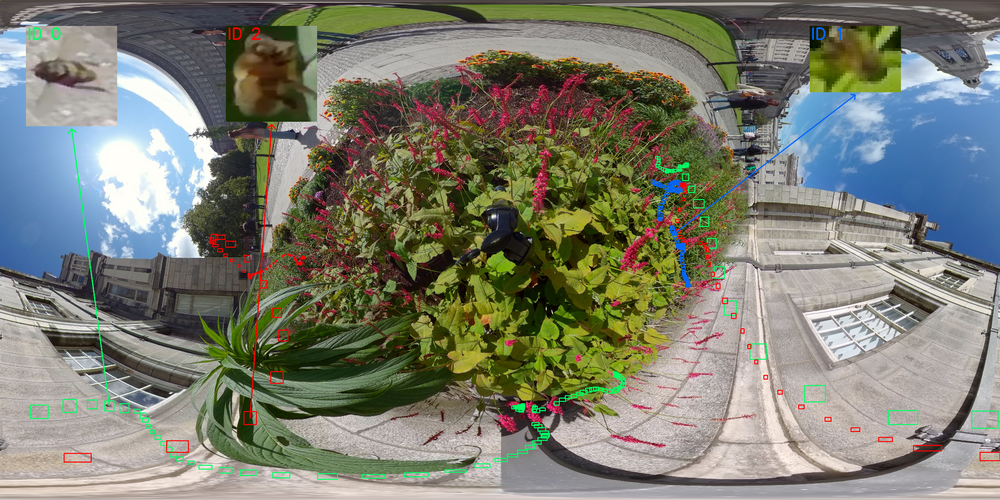
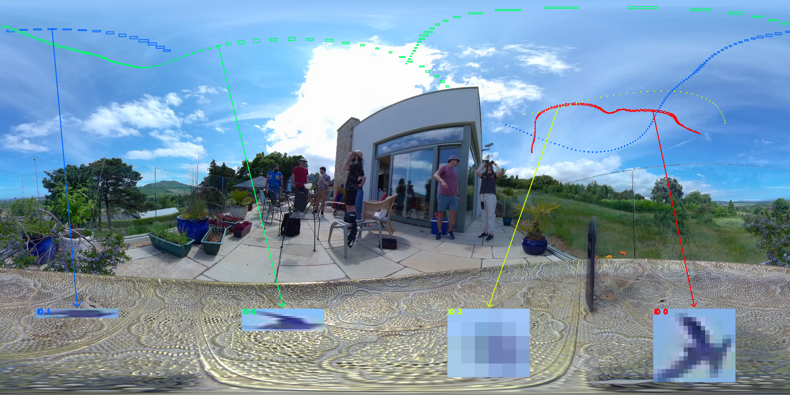

# Re-Engineering Sort-Based Algorithms for Low Cost Small Object Tracking from Omnidirectional Footage

**"Re-Engineering Sort-Based Algorithms for Low Cost Small Object Tracking from Omnidirectional Footage"**

---

## Overview

Tracking very small objects in omnidirectional video is difficult because targets occupy only a tiny fraction of the image, appearance cues are weak, and fisheye distortion further complicates motion estimation and association. This repository contains the code, experiment setup, and result summaries for our ICIP 2026 paper on adapting SORT-style tracking methods to this setting.

Our work focuses on low-cost tracking for small objects in omnidirectional footage, with an emphasis on:
- robust association for tiny, fast-moving targets,
- lightweight motion modelling,
- and practical tracking under constrained compute settings.

> **Note**
> Replace this paragraph with the exact abstract from the submitted paper once you are ready to make the repo public.

---

## Dataset Snapshot

Below are example frames from the dataset / evaluation setup.

<p align="center">
  
  
</p>
<p align="center">
  
  
</p>
Representative frames from four omnidirectional sequences illustrating object trajectories. Coloured bounding boxes accumulated over time visualise the per-object tracks in the equirectangular projection. The upper-right frame shows honey bees around a flower bed (after a 90◦ vertical rotation of projection), while the remaining frames show avian species. Insets show zoomed-in crops of several tracked identities, highlighting strong appearance ambiguity.

## Method

Our approach revisits SORT-style tracking for omnidirectional small-object scenarios and introduces modifications designed for weak-appearance, motion-dominated tracking.

### 1. OmniEuc

**OmniEuc** is the proposed association metric tailored to omnidirectional imagery.

**Intuition.**
Standard image-plane distances are often poorly matched to omnidirectional geometry. OmniEuc is designed to provide a more suitable notion of proximity for associating small objects across frames in this setting.

**TODO: add exact paper wording here**
- What geometric coordinates are used
- How the distance is computed
- Why it is preferable to IoU / GIoU / standard Euclidean distance in this scenario

---

### 2. Kalman Speed Update

We modify the standard SORT Kalman-filter motion update to better reflect the motion behaviour of small objects in omnidirectional footage.

**Motivation.**
For tiny objects, box shape and overlap cues can be unstable, while motion can be abrupt and difficult to estimate reliably. A speed-aware update helps stabilize prediction and improve downstream association.

**TODO: add exact paper wording here**
- What state update is changed
- Whether velocity is estimated differently
- How this differs from vanilla SORT / OC-SORT

---

### 3. OmniSORT

**OmniSORT** is the resulting tracker obtained by combining:
- the proposed Kalman speed update,
- the proposed OmniEuc association,
- and the SORT-style online tracking pipeline.

At a high level, OmniSORT is intended to remain lightweight while improving association quality for small objects in omnidirectional footage.

---

## Results

### Main Tracking Results

Replace this with your final numbers.

| Method | HOTA ↑ | MOTA ↑ | IDF1 ↑ | ID Sw. ↓ |
|---|---:|---:|---:|---:|
| SORT | -- | -- | -- | -- |
| OC-SORT | -- | -- | -- | -- |
| OmniSORT | -- | -- | -- | -- |

---

### Ablation Study

You mentioned including ablations, so here is a template that matches that structure.

| Variant | Association Metric | Kalman Update | HOTA ↑ | MOTA ↑ | IDF1 ↑ | ID Sw. ↓ |
|---|---|---|---:|---:|---:|---:|
| Baseline SORT | IoU | Original | -- | -- | -- | -- |
| SORT + modified Kalman | IoU | Proposed | -- | -- | -- | -- |
| SORT + modified Kalman | GIoU | Proposed | -- | -- | -- | -- |
| SORT + modified Kalman | OmniEuc | Proposed | -- | -- | -- | -- |
| OmniSORT | OmniEuc | Proposed | -- | -- | -- | -- |

You can also add a short takeaway under the table:

> The ablation study shows that the proposed Kalman speed update improves the SORT baseline, and replacing standard association with OmniEuc yields further gains. Combining both gives the best overall performance.

---

## Installation

```bash
git clone https://github.com/<your-username>/<repo-name>.git
cd <repo-name>

# create environment
conda create -n omnisort python=3.10 -y
conda activate omnisort

# install dependencies
pip install -r requirements.txt